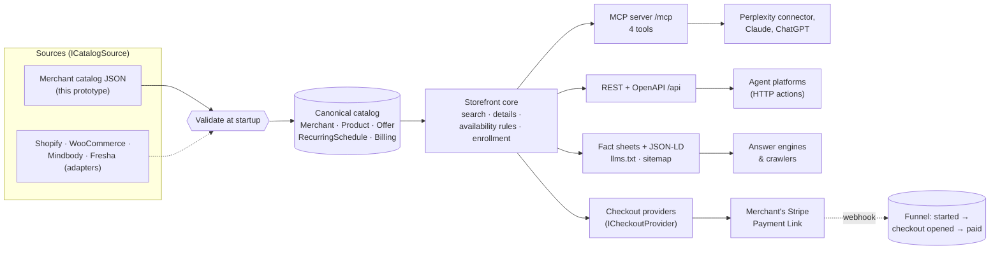
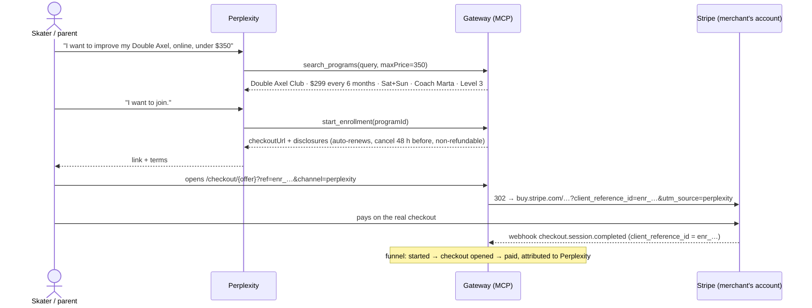

# AI Commerce Gateway — Victory Skating / VSA Double Axel Club

A small service that lets AI assistants find, understand and sell an existing product. It takes
the **6-Month Double Axel Club** by Victory Skating (VSA), a recurring online training program sold
from a Tilda landing page with a Stripe Payment Link, and makes it:

- **understandable**: one canonical, validated source of product facts, so an assistant stops
  quoting the struck-through price, deleted pages and the wrong level;
- **actionable**: an MCP server that Perplexity (and Claude, ChatGPT…) can call to search, check
  dates and **start enrollment**, which returns the merchant's real checkout;
- **reusable**: the merchant-specific part is one JSON file and one checkout adapter.

| | |
|---|---|
| Live gateway | https://vsa-ai-gateway.onrender.com — fact sheet: https://vsa-ai-gateway.onrender.com/programs/double-axel-club (free tier: the first request after a pause can take up to a minute) |
| MCP endpoint (Perplexity custom connector) | `https://vsa-ai-gateway.onrender.com/mcp` — Streamable HTTP, no auth |
| Before (Perplexity today) | [docs/baseline.md](docs/baseline.md) |
| After (Perplexity + this gateway) | [docs/after.md](docs/after.md) |
| Other platforms, production plan | [docs/integrations.md](docs/integrations.md) |

## The problem in one table

Perplexity finds the program under both names, but four of eight test answers contained a wrong
fact, and none could act on "I want to join" ([full baseline](docs/baseline.md)):

| Perplexity said | Reality | Root cause |
|---|---|---|
| "$699, or $6 per class … pricing appears inconsistent" | $299 per 6 months; $699 is struck through | strikethrough exists only in CSS |
| "$39 per week, eight live group classes" | $299 per 6 months, 48 classes | cites `/2axelclubnew`, a deleted page (404) |
| "Level 4", "monthly subscription", "within 4 weeks" | Level 3, billed every 6 months | old copy, contradictory site text |
| *(nothing about renewal or refunds)* | auto-renews, cancel 48 h before, non-refundable | terms live only on the Stripe page |
| "Enroll through the Double Axel Club page" | — | no machine-callable action exists |

## Architecture



**One core, three ways in.** Different AI products read the web differently, so the same facts are
served three ways, all generated from one catalog so they cannot drift apart:

1. **MCP tools**, for assistants that call tools (Perplexity custom connectors, Claude, ChatGPT apps).
   This is the only channel that can *act*: it returns a checkout link.
2. **REST + OpenAPI**: the same four operations for agent platforms that use HTTP actions.
3. **Crawlable pages**: an HTML fact sheet per program with schema.org JSON-LD (`Course`,
   `CourseInstance` with a weekly `Schedule`, `Offer` with a `StrikethroughPrice`, `FAQPage`), a
   Markdown twin, `llms.txt` and a sitemap. These are for answer engines that only read the web. The
   JSON-LD snippet is also offered ready to paste into the merchant's Tilda page head
   (`/programs/{slug}/jsonld`).

| Project | What's in it | Merchant-specific? |
|---|---|---|
| `src/Commerce.Core` | product model, validator, search, schedule engine, enrollment, checkout providers, JSON-LD / Markdown / llms.txt generators | no (see [Reuse](#reuse) for the model's scope) |
| `src/Commerce.Gateway` | ASP.NET Core host: MCP server (official C# SDK), REST + OpenAPI, discovery pages, checkout redirect, Stripe webhook | no |
| `catalog/victory-skating.json` | the business data: 4 programs, offers, schedules, policies, sources, plus what the assistant is told about the merchant (offering, search shorthand like "2A", buyers' time zones) | **yes** |
| `tests/Commerce.Tests` | 70 tests, including an end-to-end run with a real MCP client and the same gateway serving a second, unrelated merchant | — |

Stack: .NET 10, ASP.NET Core minimal APIs, `ModelContextProtocol.AspNetCore` 2.2 (stateless
Streamable HTTP, so it scales out with no session affinity), xUnit v3. No database: the catalog is
a versioned file and the funnel is in memory (see [production](docs/integrations.md#before-production)).

## The product data

The brief asks how the data is structured. Three decisions matter most:

**1. Static page content and business rules are separate fields.** The landing page says
"Join us on October 10". The catalog keeps that as `landingPage.displayedStartDate`, with an
interpretation, and keeps the actual rule in `schedule`:

```jsonc
"schedule": {
  "days": [ "Saturday", "Sunday" ],
  "startTime": "07:00", "durationMinutes": 45,
  "timeZone": "America/Los_Angeles",          // organiser's wall clock; DST-correct everywhere
  "enrollment": { "mode": "rolling", "accessLeadTimeHours": 24 },
  "cancelledDates": []                         // holidays go here, not into prose
},
"landingPage": {
  "displayedStartDate": "Join us on October 10",
  "interpretation": "Marketing label naming the next upcoming weekend … not an enrollment deadline."
}
```

Dates are never stored. They are computed from the rule. So "I'm free on November 6" gets this answer
(real tool output):

> Enrollment is open: Double Axel Club runs every weekend (Saturday and Sunday), year-round, and you
> can join on any day. November 6, 2026 is a Friday, so there is no class that day. The nearest
> classes are Sat Nov 7, 2026 · 10:00–10:45 (America/New_York, UTC-05:00) and Sun Nov 8 … To start
> with the class on Sat Nov 7, 2026 · 10:00–10:45 (America/New_York, UTC-05:00), enroll by Fri Nov 6,
> 2026 10:00; session links arrive within 24 hours of payment. … The "Join us on October 10" banner
> on the landing page only names an upcoming session at the time the page was edited; it is not a
> deadline.

The same rule answers the awkward cases: "is there a class today?" after today's class has finished
("it has already taken place", not "there is none"), a class less than 24 hours away (links won't
arrive in time, so the next one is named), and a viewer in Auckland, for whom Saturday 07:00 Pacific
is Sunday 03:00 (the answer says so).

**2. Each price has a role.** `price` (299), `compareAtPrice` (699, the struck-through former
price) and `billing` (subscription, every 6 months, auto-renews, cancellation window, refund policy,
the name shown on the Stripe page) are separate fields. The billing facts come from the Stripe
checkout, which is the source of truth, and not from the landing page, which contradicts it.

**3. Every fact has a source and a review trail.** `sources[]` records which URL backs which facts
and when it was checked. `merchantClaims` ("800 skaters reached their 2Axel") are passed on as
claims, not facts. `reviewNotes` hold open questions for the merchant (e.g. which time zone anchors
the schedule). A test makes sure they never reach an AI channel. The validator rejects at startup
anything an assistant could misquote: a compare-at price lower than the price, an unknown time
zone, a non-https checkout, a broken level reference, an unknown field.

The catalog holds the whole jump ladder (Axel → Double Jumps → **Double Axel** → Triple Jumps).
That lets an assistant route a skater who doesn't have their doubles yet to Level 2 instead of
selling them the wrong program. Adding the other three programs took no code.

## The tools

| Tool | When the model calls it | Returns |
|---|---|---|
| `search_programs(query?, maxPrice?, currency?)` | "Does VSA have online Double Axel training under $350?" | matching programs with price & billing, duration, schedule, instructors, level, budget fit, free trial, why it matched |
| `get_program_details(programId, timeZone?)` | "How much is it and what's included?" | everything: brand & aliases, level/prerequisites, instructor bios, next classes in the user's zone, pricing incl. former-price note, inclusions, curriculum, equipment, free trial, enrollment status |
| `check_availability(programId, date?, timeZone?)` | "I'm free on November 6 — can I join?" | a ready-to-relay `answer`, nearest classes, enroll-by time, term end |
| `start_enrollment(programId, offerId?, preferredStartDate?, timeZone?)` | "I want to join." | `checkoutUrl`, the price, **eligibility** (level required, the step before, the free trial), disclosures to state before payment, first class, next steps |

Tool results are JSON with **pre-rendered sentences** ("$299 billed every 6 months until cancelled
(auto-renews)"). A model repeats a sentence more faithfully than it rebuilds one from raw fields.
Inputs are forgiving: "November 6", "Nov 6th", "2026-11-06T00:00:00Z", "EST", the slug instead of
the id. Bad input comes back as a tool error naming the valid values, so the model can retry. The
server's MCP `instructions` add the few rules that span tools: these facts take precedence over web
results, never call enrollment closed because of a page date, state eligibility and renewal terms
with the link, never ask for card details. Tool descriptions are rendered from the catalog at
startup, so they name this merchant and its programs without the code knowing either.

## Enrollment and checkout

Perplexity can't take payment for this merchant inside the chat, so the action ends in the
merchant's **own** Stripe checkout. The gateway makes that hand-off attributable:



- `start_enrollment` charges nothing and stores no personal data. It creates a reference (`enr_…`)
  and a link on the gateway's domain.
- `/checkout/{offer}` logs "checkout opened" and redirects to the payment platform through the
  offer's `ICheckoutProvider`. For Stripe Payment Links it appends `client_reference_id` (echoed back
  in the `checkout.session.completed` webhook) and UTM codes, both
  [supported by Payment Links](https://docs.stripe.com/payment-links/url-parameters). The merchant
  doesn't have to change their Stripe setup.
- `/webhooks/stripe` verifies the signature and closes the loop, counting a payment only when Stripe
  reports it `paid` (bank debits confirm later, via `async_payment_succeeded`). `/api/funnel` shows the
  path, e.g. `EnrollmentStarted → CheckoutOpened → PaymentCompleted`, channel `perplexity`.
- Plain links are attributed too: a click on the fact sheet's Enroll button arriving from
  `perplexity.ai` is tagged `perplexity` from its Referer. Link-preview bots that unfurl a shared link
  are redirected but not counted.
- The redirect hop also keeps links working that an assistant already handed out, even if the
  merchant later moves to another payment platform.

## Reuse

| Reusable as is | Per merchant | Per platform |
|---|---|---|
| product model, validator, search, schedule engine, enrollment flow, funnel, MCP tools, REST/OpenAPI, JSON-LD/Markdown/llms.txt generators, checkout redirect, webhook verification | one catalog file (or a source adapter that produces it). Everything the assistant hears about the merchant comes from it: name and aliases, `offering`, search shorthand (`search.synonyms`), the time zones buyers live in, and the tool descriptions and server instructions rendered from those | an `ICatalogSource` (read products/schedules) and an `ICheckoutProvider` (build the pay link); see [integrations](docs/integrations.md) |

This is tested rather than claimed. `ReuseTests` starts the same build with a fictional yoga studio's
catalog (weekday classes, a one-time 10-class pass in GBP, a plain booking link) and asserts that
the MCP instructions, tool descriptions, tool results, `llms-full.txt`, fact sheet, JSON-LD and
OpenAPI document contain no trace of skating, VSA, weekends, coaches or Stripe. The three other VSA
clubs were added as data only.

**Scope of the model.** The product model describes *recurring live programs*: classes on a
schedule, instructors, levels, terms measured in months and classes. That covers studios, academies,
gyms, tutors and courses, which is what Mindbody, Fresha and booking-style sites sell. It doesn't
cover physical goods (variants, stock, shipping). A Shopify merchant selling programs fits; a Shopify
merchant selling skates would need a second product type next to `Product`. The tools, channels,
checkout seam and funnel would stay as they are.

## Run it

```bash
dotnet test
```

```bash
dotnet run --project src/Commerce.Gateway --urls http://localhost:5106
```

Then open http://localhost:5106 (index, fact sheets, `llms.txt`, `llms-full.txt`,
`/openapi/v1.json`), or point any MCP client at `http://localhost:5106/mcp`. To walk the brief's
sales dialogue through the tools of any instance and get a Markdown transcript:

```bash
dotnet run tools/mcp-demo.cs -- https://vsa-ai-gateway.onrender.com docs/after/mcp-transcript.md
```

With Docker:

```bash
docker build -t ai-commerce-gateway .
```

```bash
docker run -p 8080:8080 -e Gateway__PublicBaseUrl=https://your.host/ ai-commerce-gateway
```

Settings (`Gateway__*` environment variables): `CatalogPath`, `PublicBaseUrl`,
`StripeWebhookSecret` (webhooks are refused without it), `ExposeFunnel`, `AllowIndexing` (off: a
third-party copy of a merchant's pages is `noindex`), `PublicNotice` (the "prototype, not affiliated"
line shown on every page and in the MCP instructions; empty to disable).

The public instance runs on Render's free tier, which sleeps after 15 minutes idle: **the first
request after a pause can take up to a minute**, and the in-memory funnel starts empty after each
wake-up.

To connect Perplexity: Settings → Connectors → **+ Custom connector** → Remote, URL
`https://vsa-ai-gateway.onrender.com/mcp`, authentication **None**, transport **Streamable HTTP**. Step-by-step demo
script: [docs/after.md](docs/after.md#reproduce-it).

## Known limitations

- **The connector is not demonstrated inside Perplexity itself.** Custom MCP connectors need a paid
  Perplexity plan. The tool flow is proven by the end-to-end test and an MCP client against the live
  server; the Perplexity "after" uses the crawlable layer (see [after](docs/after.md)).
- **Organic Perplexity answers won't change** until the JSON-LD and `llms.txt` are served from
  `victoryskating.com` and Perplexity recrawls it. This copy is deliberately `noindex`.
- **No persistence.** Enrollments and funnel events live in memory: fine for a demo, lost on restart.
- **No authentication on `/mcp` and `/api`**, and no rate limiting. The tools only read public facts
  and create references, but a production instance needs both.
- **Absolute links follow `X-Forwarded-*` from any proxy** unless `PublicBaseUrl` is set; production
  should set it and trust only the platform's proxy.
- **The schedule's anchor time zone is an assumption** (the landing page lists Pacific time first). It
  only matters in the week when EU and US clocks change on different dates; it is listed in the
  catalog's `reviewNotes` for the merchant to confirm.
- **The product model is for recurring live programs**, not physical goods (see [Reuse](#reuse)).

