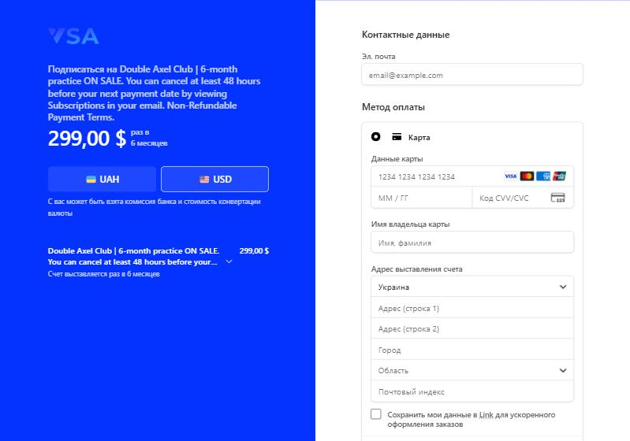
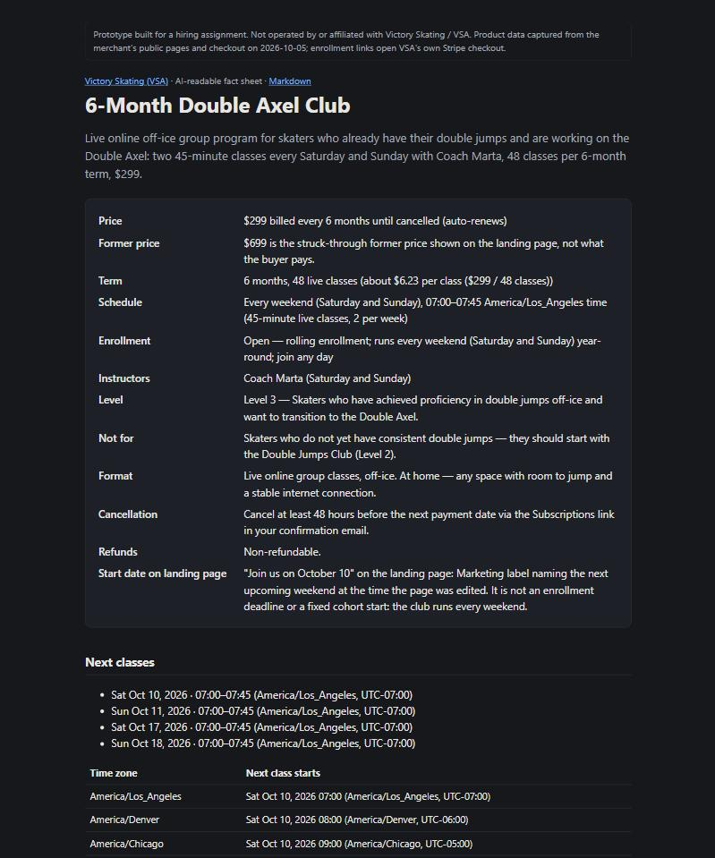

# After: Perplexity with the gateway connected

**Read this first.** Asking ordinary Perplexity the baseline questions again will give the same
answers as before, and that is expected. Perplexity's own index changes only when the merchant
serves the new data from `victoryskating.com` (the JSON-LD snippet from `/programs/{slug}/jsonld`
pasted into each Tilda page, and `llms.txt` on the domain) and Perplexity recrawls it. This
prototype runs on a third-party host and is deliberately `noindex`, so it can't change organic
answers and shouldn't try to.

The "after" therefore shows the two mechanisms the gateway adds, each in Perplexity where possible:

1. **Perplexity reading the AI-ready layer.** The same questions, with the gateway's
   `llms-full.txt` in context. This is what Perplexity will see once the merchant publishes the layer
   on their domain. No tools are involved; the answer can still offer the checkout link from the
   fact sheet.
2. **An assistant acting through the MCP tools.** Search → availability → `start_enrollment` →
   tracked redirect to Stripe → funnel. In Perplexity this needs a paid plan (custom connectors), so
   it is shown with an MCP client against the live server, plus the end-to-end test that runs it on
   every CI build.

## 1. Perplexity reading the AI-ready layer

<!-- PERPLEXITY_AFTER -->
_Pending._ Perplexity opens a URL named in the prompt only for signed-in users; signed out it
answers "Sign up and repeat your request" (checked 2026-10-06). This part is run with a free
account.

## 2. The tool flow, against the live server

Run on 2026-10-06 against https://vsa-ai-gateway.onrender.com/mcp, with the official C# MCP SDK as
the client ([`tools/mcp-demo.cs`](../tools/mcp-demo.cs)). It sends the same requests and gets the same
JSON a Perplexity custom connector would. Full transcript: [after/mcp-transcript.md](after/mcp-transcript.md).

| The brief's step | Tool call | What came back | Before (Perplexity today) |
|---|---|---|---|
| "I want to improve my Double Axel … under $350." | `search_programs(query, maxPrice: 350)` | the Double Axel Club only; **$299 billed every 6 months until cancelled (auto-renews)**; every weekend 07:00–07:45 Pacific; Coach Marta; within budget | $299, but no coach, times or terms |
| "How much is it and what is included?" | `get_program_details` | $299; **"$699 is the struck-through former price … not what the buyer pays"**; Level 3 and who it's for; all 7 inclusions; cancel ≥48 h before the next payment; non-refundable | "$699 … pricing appears inconsistent" |
| "I'm free on November 6. Can I join around then?" | `check_availability(date: 2026-11-06)` | Nov 6 is a Friday; nearest classes **Sat Nov 7 and Sun Nov 8, 10:00–10:45 New York time**; enroll by Fri Nov 6 10:00; "Join us on October 10" is not a deadline | Sat/Sun, but no times and no way to enroll |
| "I want to join." | `start_enrollment` | **checkoutUrl**, eligibility (Level 3; else Double Jumps Club; free 4-day plan), four disclosures, first class Sat Nov 7 | "$39 per week", "monthly subscription", a link to the landing page |
| the user opens the link | `GET /checkout/vsa-double-axel-club-6m?ref=enr_…` | **302** → `buy.stripe.com/…?client_reference_id=enr_…&utm_source=…&utm_medium=ai-assistant` | — |
| — | `GET /api/funnel` | `EnrollmentStarted` → `CheckoutOpened` for that reference | — |

The checkout the link lands on is the merchant's real Stripe page, with our reference in the URL
(shown in USD; the page localises the language):



The fact sheet the assistant and crawlers read
([live](https://vsa-ai-gateway.onrender.com/programs/double-axel-club)):



## Reproduce it

You need a Perplexity plan that includes custom connectors (Pro, Max or Enterprise, as of 2026).

1. **Add the connector.** perplexity.ai → Settings → **Connectors** → **+ Custom connector** →
   **Remote**.
   - Name: `Victory Skating (VSA)`
   - MCP server URL: `https://vsa-ai-gateway.onrender.com/mcp`
   - Authentication: **None**
   - Transport: **Streamable HTTP**
   - Tick the risk acknowledgement → **Add**, then enable the connector.
2. **Start a new thread** and make sure the connector is switched on for it (sources/tools menu
   under the input box).
3. **Ask the brief's questions**, one thread each:
   - Does Victory Skating have an online Double Axel training program?
   - Does VSA offer online training for Double Axel?
   - I'm looking for an online Double Axel training program under $350 for six months. Does Victory Skating have anything?
   - How much is the Victory Skating / VSA Double Axel Club and what is included?
   - I want online training to improve my Double Axel. Can I join the VSA program?
   - I'm free on November 6. Can I join the Double Axel program around that time?
4. **Run the sales flow** in one thread:
   1. I want to improve my Double Axel and I'm looking for an online program under $350.
   2. I want to join.

   Expected: the second answer contains a link `https://vsa-ai-gateway.onrender.com/checkout/vsa-double-axel-club-6m?ref=enr_…&channel=perplexity`
   plus the renewal, cancellation and refund terms. Opening it lands on the merchant's Stripe page
   ("Double Axel Club | 6-month practice ON SALE"). **Don't pay**: it is the live checkout.
5. **See the trace.** `https://vsa-ai-gateway.onrender.com/api/funnel` shows `EnrollmentStarted` and `CheckoutOpened` for
   that reference with channel `perplexity`. Perplexity's answer also lists the tool calls it made.

Without a Perplexity plan, the same server works in any MCP client, for example the
[MCP Inspector](https://github.com/modelcontextprotocol/inspector):

```bash
npx @modelcontextprotocol/inspector
```

Choose transport "Streamable HTTP" and URL `https://vsa-ai-gateway.onrender.com/mcp`.
