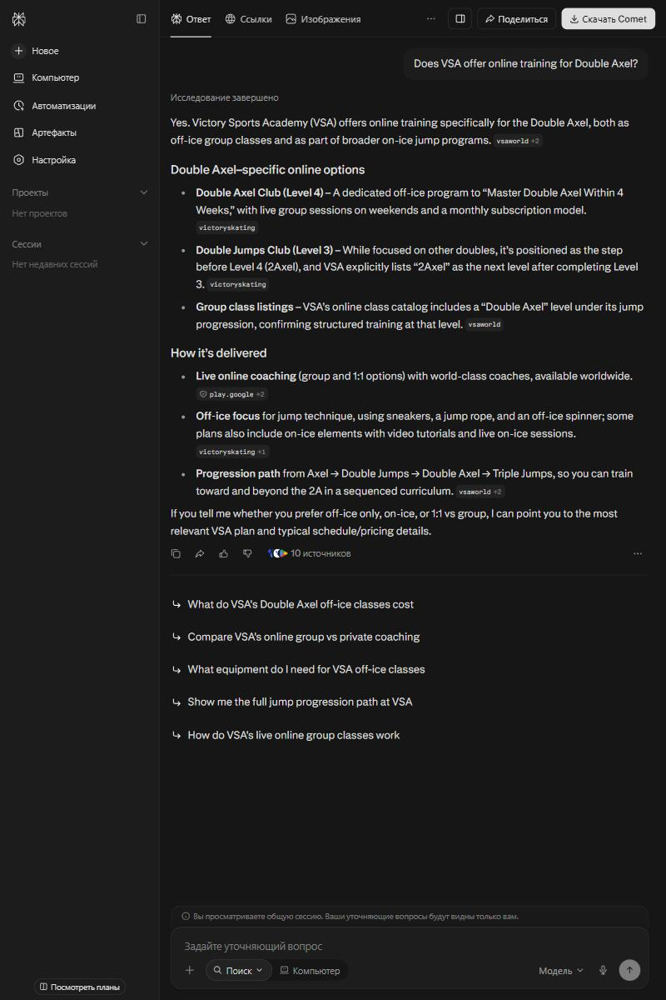

# Before: how Perplexity handles the Double Axel Club today

Tested on **2026-10-05** in perplexity.ai, signed out (no personalisation, no connectors), default
model. Every thread below is a public link, so the answers can be re-read as Perplexity gave them.
Verbatim answers and the ground-truth check are in [baseline-raw.md](baseline-raw.md).

## Results

| # | Query | Product found? | Correct | Wrong or missing | Direct enrollment? |
|---|-------|---|---|---|---|
| [Q1](https://www.perplexity.ai/search/a5afc9c9-e401-4e1f-bcf2-1f00a53d5135) | Does Victory Skating have an online Double Axel training program? | Yes | online, live group, six months, off-ice | no price, coach, schedule or level | No |
| [Q2](https://www.perplexity.ai/search/0558ba4a-5911-4cbb-9822-b0e4ea75702c) | Does VSA offer online training for Double Axel? | Yes, "Victory Sports Academy (VSA)" | weekend live group sessions, progression ladder | **"Level 4"** (it is Level 3), **"Master Double Axel within 4 weeks"**, **"monthly subscription model"**, Double Jumps Club as **"Level 3"** (it is Level 2); no price | No |
| [Q3](https://www.perplexity.ai/search/fed69c30-8f58-4ebb-95a9-bdb88cfcb791) | …under $350 for six months. Does Victory Skating have anything? | Yes | $299, 48 classes, 2 per weekend, free workbook | coach, times, renewal terms | No |
| [Q4](https://www.perplexity.ai/search/27853dae-8420-473c-ad47-daa9a2acab7c) | How much is the Victory Skating / VSA Double Axel Club and what is included? | Yes | inclusions (classes, workbook, $5 discount) | **"listed at $699, or $6 per class; the page also displays $299 … pricing appears inconsistent"** | No |
| [Q5](https://www.perplexity.ai/search/e1807826-e007-4286-a344-3d334ab072cf) | I want online training to improve my Double Axel. Can I join the VSA program? | Yes | prerequisite (double jumps off-ice), six-month club | "via Zoom" is not stated anywhere by the merchant; no schedule | No |
| [Q6](https://www.perplexity.ai/search/a23183a6-cd85-4086-845f-e886be4b86b6) | I'm free on November 6. Can I join … around that time? | Yes | Sat & Sun classes; Nov 6 2026 is a Friday → Nov 7 | no class times, no way to enroll | No |
| [Q7](https://www.perplexity.ai/search/b581b6b7-4942-41dd-8cc9-71d2f5895e7e) | I want to improve my Double Axel and I'm looking for an online program under $350. | Yes | $299, 48 classes, level fit | the follow-up "I want to join." can't be sent signed out | No |
| [Q8](https://www.perplexity.ai/search/f4c3df40-57e6-4acd-8638-92ac53cd119f) | I want to join the Victory Skating VSA Double Axel Club. How do I enroll and pay? | Yes | confirmation email, links within 24 h, contact email | **"purchase the monthly subscription"**; **"$39 per week and includes eight live group classes"**; links the landing page, not the checkout; says nothing about auto-renewal or refunds | **No** — landing page only |

**Summary.** Discovery is fine: Perplexity finds the program for both brand names. What it says
about the program is unreliable. Four of eight answers carry a wrong fact (price, level, billing
model, duration claim). None gives the coach, the class times or the renewal terms, and none can act
on "I want to join" beyond pointing at the landing page.

## Why it goes wrong

| Cause | Evidence | Fix in this prototype |
|---|---|---|
| The page has no machine-readable data: no JSON-LD, empty `og:description`, no `llms.txt` | page source of /doubleaxel; `/llms.txt` → 404 | Canonical catalog → JSON-LD, Markdown fact sheets, `llms.txt` |
| Meaning carried by CSS only: $699 is struck through visually, but in the text it is just "$699" | Q4 "pricing appears inconsistent" | `compareAtPrice` in the model; JSON-LD `priceType: StrikethroughPrice`; explicit "former price" sentence |
| Stale index: a deleted page is still cited | Q8's "$39 per week" comes from `/2axelclubnew`, which now returns **404** | Tools state "these facts supersede web results"; every fact carries its source and verification date |
| Site copy contradicts the checkout: "How it works" says "monthly subscription"; Stripe bills every 6 months | Q2, Q8 | Billing taken from the Stripe checkout (source of truth), copy issues listed for the merchant |
| Billing terms exist only on the Stripe page: auto-renewal, 48-hour cancellation window, non-refundable | Stripe Payment Link page | Terms are part of the offer; `start_enrollment` returns them as disclosures to state before paying |
| Schedule is a static table ("9 – 9.45 PM ICT"), correct only in northern summer | Bangkok is 22:00 after US clocks change | Schedule is a weekly rule in the organiser's zone; times are computed per date and zone |
| "Join us on October 10" reads like a cohort start | the brief's own warning | Landing-page text kept apart from the enrollment rule (rolling) |
| Nothing to act on: the only action is "go to the landing page" | Q8 | `start_enrollment` → tracked checkout link to the real Stripe page |

## Site issues to raise with the merchant

These are content bugs on the merchant's own pages. The prototype works around them; fixing them
at the source also helps every crawler:

- `/2axelclubnew` is gone but still indexed. Redirect it (301) to `/doubleaxel`.
- "How It Works → purchasing your monthly subscription" contradicts the 6-month billing.
- Axel Club page: the "Coach Emre" card carries a bio for "Ines"; "After completing Level 2 … join
  Level 3. Double Jumps" has the wrong level numbers.
- The timetable labels (PDT, CEST) are only right half the year.
